# Teacher Dashboard UI/UX Specification

> **Version:** 1.0
> **Date:** January 10, 2026
> **Author:** Sally (UX Expert)
> **Status:** Draft - Pending Stakeholder Review

---

## 1. Introduction

This document defines the user experience goals, information architecture, user flows, and visual design specifications for the **Knasty Portal Teacher Dashboard Redesign**. It serves as the foundation for visual design and frontend development, ensuring a cohesive and user-centered experience.

### 1.1 Overall UX Goals & Principles

#### Target User Personas

**Teacher (Primary):**
- Sunday School teachers managing 1-3 classes
- Need quick access to attendance, student progress, and pending approvals
- Often time-constrained (checking between services or activities)
- May not be technically savvy - need clear, simple interfaces
- Arabic-first users with English as secondary language

#### Usability Goals

1. **Task Completion Speed:** Teachers can complete core tasks (take attendance, approve trip requests) in under 3 clicks
2. **Information Findability:** All teacher-relevant data visible on dashboard without navigation
3. **Error Prevention:** Clear confirmation for irreversible actions (rejecting student requests)
4. **Context Awareness:** Always show which class/student/activity context teacher is in
5. **Offline Resilience:** Key actions should gracefully handle connectivity issues

#### Design Principles

1. **Teacher's Time is Sacred** - Every second counts; minimize cognitive load
2. **Show, Don't Hide** - Surface actionable items proactively on dashboard
3. **Context is King** - Always display class/student context in headers
4. **Mobile-First Admin** - Teachers often use phones between activities
5. **Bilingual by Default** - RTL/LTR layouts work seamlessly

---

## 2. Information Architecture

### 2.1 Site Map / Screen Inventory


**Design Decisions:**
- **Student Drawer pattern** - Student profile opens as overlay, preserving page context
- **Quick Attendance** - Direct action from dashboard, bypassing navigation
- **Conditional nav items** - "My Trips" only visible if teacher organizes trips
- **Global search** - Header-level, always accessible

### 2.2 Navigation Structure

**Primary Navigation (Bottom Nav on Mobile / Sidebar on Desktop):**

| Icon | Label | Badge | Visibility |
|------|-------|-------|------------|
| 🏠 | Dashboard | - | Always |
| 📚 | My Classes | Count | Always |
| ⚡ | Action Required | Pending count | Always (red if > 0) |
| 📢 | My Announcements | Unread count | Always |
| 🚌 | My Trips | - | Conditional (only if organizing) |

**Header Elements:**
- 🔍 Global Search (students, classes, trips)
- 🌐 Language Toggle (AR/EN)
- 👤 Profile Menu

**Secondary Navigation (Contextual Tabs):**

| Context | Tabs |
|---------|------|
| Class Details | Roster \| Attendance \| Analytics |
| Trip Details | Participants \| Organizers \| Attendance |
| Student Drawer | Profile \| Points \| Activities \| Attendance |

**Breadcrumb Strategy:**
```
Dashboard > My Classes > Grade 5 - St. Mark > Roster
                                             └── [Ahmed Hassan] ← Drawer overlay
```

### 2.3 Key Improvements Over Current State

| Current State | New Design | Impact |
|---------------|------------|--------|
| 3 quick actions | Dashboard with stats + pending list | 5x more actionable info |
| No "My Classes" page | Dedicated hub with class cards | Central management |
| Approvals in 4 places | Unified "Action Required" queue | Single source of truth |
| Student = full page navigation | Student = contextual drawer | 60% less context switching |
| No search | Global search in header | Find anyone instantly |
| Static 5-item nav | Conditional nav items | Cleaner for simple cases |

---

## 3. User Flows

### 3.1 Flow: Take Daily Attendance

**User Goal:** Mark attendance for my class quickly before/after Sunday School session

**Entry Points:**
- Dashboard "Take Attendance" quick action (primary)
- My Classes → Class Card → Attendance tab
- Action Required → "Attendance not taken" reminder

**Success Criteria:**
- All students marked in < 2 minutes
- Confirmation shown
- Stats update immediately

```mermaid
graph TD
    A[Dashboard] --> B{Quick Attendance}
    B --> C[Select Class - if multiple]
    C --> D[Today's Date Auto-selected]
    D --> E[Student Roster Grid]
    E --> F{Mark Each Student}
    F -->|Present| G[✓ Green]
    F -->|Absent| H[✗ Red]
    F -->|Excused| I[⚠ Yellow]
    F -->|Late| J[🕐 Orange]
    E --> K[Bulk Actions]
    K --> L[Mark All Present]
    K --> M[Mark All Absent]
    E --> N[Save Attendance]
    N --> O[Success Toast]
    O --> P[Return to Dashboard]
```



**Edge Cases & Error Handling:**
- **No classes assigned:** Show empty state with "Contact your church admin"
- **Attendance already taken:** Show "Edit" mode with existing data
- **Network error:** Queue locally, sync when online, show pending indicator
- **Late addition:** Allow adding attendance for past 7 days only

### 3.2 Flow: Approve Trip Registration

**User Goal:** Review and approve/reject student requests to join a trip I'm organizing

**Entry Points:**
- Action Required badge (primary)
- My Trips → Trip Card → Participants tab
- Push notification (if enabled)

**Success Criteria:**
- Clear student context visible
- One-tap approve/reject
- Optional rejection reason
- Student notified of decision


**Edge Cases & Error Handling:**
- **Trip is full:** Show warning, still allow approve (organizer override)
- **Student already approved elsewhere:** Show conflict notice
- **Parent-initiated request:** Show parent badge, may need different flow
- **Bulk approve:** Select multiple → Approve all (for trusted groups)

### 3.3 Flow: Review Competition Submission

**User Goal:** Grade/review a student's competition submission and award points

**Entry Points:**
- Action Required → Competition Reviews section
- Activities → Competitions → Pending Submissions tab

**Success Criteria:**
- View full submission content
- Award placement (1st, 2nd, 3rd) or just approve
- Points automatically calculated
- Student notified


### 3.4 Flow: View Student in Context

**User Goal:** Quickly check a student's details without losing my current context

**Entry Points:**
- Any student name/avatar across the app (universal pattern)

**Success Criteria:**
- Drawer opens over current page
- Key info visible immediately
- Deep dive available via tabs
- Close returns to exact previous state


---

## 4. Wireframes & Mockups

### 4.1 Design Files

**Primary Design Tool:** Figma (recommended)

**Recommendation:** Create a dedicated Figma project with:
- Component library synced with existing Knasty Portal design system
- Separate pages for Desktop and Mobile variants
- Prototype flows for user testing

### 4.2 Key Screen Layouts

#### Screen 1: Teacher Dashboard (Command Center)

```
┌─────────────────────────────────┐
│ 🔍 Search          AR/EN  👤    │ ← Header
├─────────────────────────────────┤
│  Welcome, Teacher Mina! 👋      │
│  St. Mark Church                │
├─────────────────────────────────┤
│ ┌─────────┐ ┌─────────┐        │
│ │ 📚 3    │ │ ⚡ 5    │        │ ← Stat Cards
│ │ Classes │ │ Pending │        │
│ └─────────┘ └─────────┘        │
│ ┌─────────┐ ┌─────────┐        │
│ │ 👥 47   │ │ 📊 89%  │        │
│ │Students │ │Attend.  │        │
│ └─────────┘ └─────────┘        │
├─────────────────────────────────┤
│ [📋 Take Attendance    →]      │ ← Primary CTA
├─────────────────────────────────┤
│ Action Required (5)             │
│ ┌─────────────────────────────┐│
│ │ 🚌 Trip: Summer Camp        ││
│ │    3 pending approvals      ││
│ │                    [View →] ││
│ └─────────────────────────────┘│
│ ┌─────────────────────────────┐│
│ │ 🏆 Competition: Bible Quiz  ││
│ │    2 submissions to review  ││
│ │                    [View →] ││
│ └─────────────────────────────┘│
├─────────────────────────────────┤
│ 🏠   📚   ⚡   📢   🚌        │ ← Bottom Nav
└─────────────────────────────────┘
```

#### Screen 2: My Classes Hub

```
┌─────────────────────────────────┐
│ ← My Classes            🔍     │
├─────────────────────────────────┤
│ ┌─────────────────────────────┐│
│ │ 📚 Grade 5 - St. Mark       ││
│ │ 15 students                 ││
│ │ [Roster] [Attend] [Stats]   ││
│ │ Last attendance: Today ✓    ││
│ └─────────────────────────────┘│
│ ┌─────────────────────────────┐│
│ │ 📚 Grade 3 - St. Mark       ││
│ │ 18 students                 ││
│ │ [Roster] [Attend] [Stats]   ││
│ │ ⚠️ Attendance not taken     ││
│ └─────────────────────────────┘│
├─────────────────────────────────┤
│ 🏠   📚   ⚡   📢   🚌        │
└─────────────────────────────────┘
```

#### Screen 3: Action Required Queue

```
┌─────────────────────────────────┐
│ ← Action Required        🔍    │
├─────────────────────────────────┤
│ [All] [Trips] [Competitions]   │ ← Filter chips
├─────────────────────────────────┤
│ TRIPS (3)                       │
│ ┌─────────────────────────────┐│
│ │ 👤 Ahmed Hassan      [info] ││
│ │ Summer Camp - Jul 15        ││
│ │ Requested: 2 days ago       ││
│ │ [✓ Approve]  [✗ Reject]     ││
│ └─────────────────────────────┘│
│ ┌─────────────────────────────┐│
│ │ 👤 Marina Girgis    [info]  ││
│ │ Summer Camp - Jul 15        ││
│ │ 👨‍👩‍👧 Parent requested         ││
│ │ [✓ Approve]  [✗ Reject]     ││
│ └─────────────────────────────┘│
├─────────────────────────────────┤
│ COMPETITIONS (2)                │
│ ┌─────────────────────────────┐│
│ │ 👤 Mina Sobhy       [info]  ││
│ │ Bible Quiz - Submission     ││
│ │        [Review Submission →]││
│ └─────────────────────────────┘│
├─────────────────────────────────┤
│ 🏠   📚   ⚡   📢   🚌        │
└─────────────────────────────────┘
```

#### Screen 4: Student Drawer (Bottom Sheet)

```
┌─────────────────────────────────┐
│ ═══════════                     │ ← Drag handle
├─────────────────────────────────┤
│  ┌────┐                         │
│  │ 👤 │  Ahmed Hassan           │
│  │    │  Grade 5 - St. Mark     │
│  └────┘  📧 parent@email.com    │
├─────────────────────────────────┤
│  ┌────────┐┌────────┐┌────────┐│
│  │⭐ 450  ││📊 92%  ││🏆 5    ││
│  │ Points ││Attend. ││Active. ││
│  └────────┘└────────┘└────────┘│
├─────────────────────────────────┤
│ [Profile] [Points] [Activities] │
├─────────────────────────────────┤
│  Parent/Guardian:               │
│  Nabil Hassan - 0123456789      │
│                                 │
│  Notes:                         │
│  Allergic to peanuts            │
├─────────────────────────────────┤
│       [Adjust Points]           │
└─────────────────────────────────┘
```

#### Screen 5: Take Attendance

```
┌─────────────────────────────────┐
│ ← Attendance        [Save ✓]   │
├─────────────────────────────────┤
│ Grade 5 - St. Mark              │
│ 📅 Sunday, Jan 10, 2026         │
├─────────────────────────────────┤
│ [Mark All Present]              │
├─────────────────────────────────┤
│ 12 of 15 marked                 │
├─────────────────────────────────┤
│ ┌─────────────────────────────┐│
│ │ 👤 Ahmed Hassan             ││
│ │ [✓] [✗] [⚠] [🕐]    [note] ││
│ └─────────────────────────────┘│
│ ┌─────────────────────────────┐│
│ │ 👤 Marina Girgis    ✓       ││
│ │ [✓] [✗] [⚠] [🕐]    [note] ││
│ └─────────────────────────────┘│
├─────────────────────────────────┤
│ Stats: ✓12  ✗2  ⚠1  🕐0       │
├─────────────────────────────────┤
│ 🏠   📚   ⚡   📢   🚌        │
└─────────────────────────────────┘
```

---

## 5. Component Library / Design System

### 5.1 Design System Approach

**Existing System:** Radix UI + Tailwind CSS v4 + CVA (Class Variance Authority)

**Approach:** Extend existing system

| Technology | Purpose |
|------------|---------|
| Radix UI | Headless, accessible primitives |
| Tailwind CSS v4 | Utility-first styling with OKLch colors |
| CVA | Component variant management |
| Lucide React | Icon library (548+ icons) |
| next-themes | Dark/light mode |
| next-intl | i18n with RTL support |

### 5.2 Existing Components to Reuse

| Component | Location | Teacher Dashboard Use |
|-----------|----------|----------------------|
| `Card` | `ui/card.tsx` | Class cards, stat cards, action items |
| `Badge` | `ui/badge.tsx` | Status indicators, counts, alerts |
| `Button` | `ui/button.tsx` | All actions (approve, reject, save) |
| `ResponsiveTable` | `ui/responsive-table.tsx` | Student roster, attendance history |
| `Sheet` | `ui/sheet.tsx` | Student drawer overlay |
| `Tabs` | `ui/tabs.tsx` | Class detail tabs, student drawer tabs |
| `EmptyState` | `ui/empty-state.tsx` | No pending items, no classes |
| `Skeleton` | `ui/skeleton.tsx` | Loading states |
| `Dialog` | `ui/dialog.tsx` | Confirmation modals |
| `FloatingActionButton` | `ui/floating-action-button.tsx` | Mobile quick actions |

### 5.3 New Components Required

#### StatCard
Display a key metric with icon, value, and label.

```typescript
interface StatCardProps {
  icon: LucideIcon
  value: number | string
  label: string
  variant?: 'default' | 'highlight' | 'warning'
  onClick?: () => void
  loading?: boolean
}
```

#### ActionRequiredCard
Display a pending action item with context and quick actions.

```typescript
interface ActionRequiredCardProps {
  type: 'trip' | 'competition' | 'activity'
  title: string
  count: number
  subtitle?: string
  onView: () => void
  onQuickAction?: () => void
}
```

#### ClassCard
Display class overview with quick action buttons.

```typescript
interface ClassCardProps {
  className: string
  churchName: string
  studentCount: number
  lastAttendance?: Date
  attendanceTaken?: boolean
  onRoster: () => void
  onAttendance: () => void
  onStats: () => void
}
```

#### StudentDrawer
Slide-up drawer showing student details without navigation.

```typescript
interface StudentDrawerProps {
  student: Student
  open: boolean
  onClose: () => void
  initialTab?: 'profile' | 'points' | 'activities' | 'attendance'
  showAdjustPoints?: boolean
}
```

#### ApprovalCard
Single pending approval with student context and action buttons.

```typescript
interface ApprovalCardProps {
  type: 'trip' | 'competition' | 'activity'
  student: StudentSummary
  itemTitle: string
  requestedAt: Date
  parentInitiated?: boolean
  onApprove: () => Promise<void>
  onReject: (reason?: string) => Promise<void>
  onStudentClick: () => void
}
```

#### QuickAttendanceButton
Dashboard primary CTA for taking attendance.

```typescript
interface QuickAttendanceButtonProps {
  classes: ClassSummary[]
  onSelectClass: (classId: string) => void
}
```

---

## 6. Branding & Style Guide

### 6.1 Color Palette

| Color Type | Light Mode | Dark Mode | Usage |
|------------|------------|-----------|-------|
| **Primary** | `#2a3f54` | Adjusted | Headers, primary buttons, nav active |
| **Secondary** | `#58b7bd` | Adjusted | Secondary actions, accents |
| **Accent** | `#e3ab4a` | Adjusted | Highlights, badges, warnings |
| **Success** | Green | Adjusted | Approval, present status |
| **Warning** | Amber | Adjusted | Excused, late, attention needed |
| **Error** | Red | Adjusted | Reject, absent, errors |

### 6.2 Typography

| Element | Size | Weight | Usage |
|---------|------|--------|-------|
| H1 | 2rem | 700 | Page titles |
| H2 | 1.5rem | 600 | Section headers |
| H3 | 1.25rem | 600 | Card titles |
| Body | 1rem | 400 | Default text |
| Small | 0.875rem | 400 | Secondary text |
| Caption | 0.75rem | 400 | Timestamps |

### 6.3 Iconography

**Icon Library:** Lucide React

| Concept | Icon |
|---------|------|
| Dashboard | `Home` |
| Classes | `BookOpen` |
| Action Required | `Zap` |
| Announcements | `Megaphone` |
| Trips | `Bus` |
| Present | `Check` |
| Absent | `X` |
| Excused | `AlertTriangle` |
| Late | `Clock` |

---

## 7. Accessibility Requirements

### 7.1 Compliance Target

**Standard:** WCAG 2.1 Level AA

**Success Metrics:**
- Lighthouse accessibility score ≥ 90
- Zero critical axe-core violations
- Task completion rate parity between keyboard and mouse users

### 7.2 Prioritized Requirements

#### P0 - Launch Blockers

| Requirement | Specification |
|-------------|---------------|
| Color Contrast | 4.5:1 text, 3:1 UI components |
| Focus Indicators | Visible 2px ring, high contrast |
| Touch Targets | Minimum 44x44px |
| Keyboard Navigation | All features accessible via keyboard |
| Form Labels | All inputs have visible labels |

#### P1 - Fast Follow

| Requirement | Specification |
|-------------|---------------|
| Screen Reader Announcements | Live regions for status updates |
| Keyboard Shortcuts | Focus-based shortcuts for approvals |
| Loading State Accessibility | `aria-busy` pattern |
| Error Recovery | Clear error messages |

### 7.3 Screen Reader Support Matrix

| Platform | Screen Reader | Priority |
|----------|---------------|----------|
| iOS | VoiceOver | P0 |
| Android | TalkBack | P1 |
| macOS | VoiceOver | P1 |
| Windows | NVDA | P2 |

### 7.4 Shared Announcement Hook

```tsx
// hooks/useAnnounce.ts
export function useAnnounce() {
  const announce = (message: string, priority: 'polite' | 'assertive' = 'polite') => {
    // Implementation with live region
  }
  return { announce, Announcer }
}
```

### 7.5 Definition of Done (Accessibility)

- [ ] Component passes axe-core automated scan
- [ ] Keyboard navigation tested manually
- [ ] Focus states visible in light and dark mode
- [ ] Works at 200% browser zoom
- [ ] Touch targets ≥ 44px verified
- [ ] Screen reader tested for new flows

---

## 8. Responsiveness Strategy

### 8.1 Breakpoints

| Breakpoint | Min Width | Target Devices | Tailwind |
|------------|-----------|----------------|----------|
| Mobile | 0 | Phones | Default |
| Tablet | 640px | Tablets | `sm:` |
| Desktop | 1024px | Laptops | `lg:` |
| Wide | 1280px | Large monitors | `xl:` |

### 8.2 Layout Adaptations

| Breakpoint | Layout | Navigation |
|------------|--------|------------|
| Mobile | Single column | Bottom nav |
| Tablet | 2-column grid | Bottom nav or sidebar |
| Desktop | Sidebar + main | Left sidebar (240px) |

### 8.3 Component Adaptations

| Component | Mobile | Desktop |
|-----------|--------|---------|
| Stat Cards | 2x2 grid | 4x1 row |
| Class Cards | Full-width stacked | 3-column grid |
| Student Drawer | Bottom sheet | Side drawer |
| Tables | Card list | Traditional table |

---

## 9. Animation & Micro-interactions

### 9.1 Motion Principles

1. **Purposeful, Not Decorative** - Every animation serves a function
2. **Quick and Responsive** - Interactions feel instant
3. **Subtle and Professional** - Appropriate for educational context
4. **Respect User Preferences** - Honor `prefers-reduced-motion`

### 9.2 Timing Standards

| Duration | Use Case |
|----------|----------|
| 75ms | Micro-feedback (button press) |
| 150ms | State changes (hover, toggle) |
| 300ms | Medium transitions (cards, tabs) |
| 400ms | Large reveals (drawers, modals) |

### 9.3 Key Animations

| Animation | Trigger | Duration |
|-----------|---------|----------|
| Button Press | Click/tap | 75ms scale |
| Card Hover | Mouse hover | 150ms shadow |
| Approval Success | Action complete | 300ms slide out |
| Drawer Open | Tap student | 400ms slide |
| Tab Switch | Click tab | 200ms crossfade |
| Badge Update | Count change | 300ms scale pulse |

---

## 10. Performance Considerations

### 10.1 Performance Goals

| Metric | Target |
|--------|--------|
| First Contentful Paint | < 1.5s |
| Largest Contentful Paint | < 2.5s |
| Time to Interactive | < 3.5s |
| Cumulative Layout Shift | < 0.1 |
| Animation FPS | 60fps |

### 10.2 Design Strategies

| Strategy | Implementation |
|----------|----------------|
| Skeleton loading | Show layout immediately |
| Optimistic updates | Update UI before server confirms |
| Image optimization | Next.js Image with lazy loading |
| Code splitting | Dynamic imports for drawer, modals |
| Virtualization | Virtual scroll for 50+ students |

---

## 11. Next Steps

### 11.1 Immediate Actions

1. **Stakeholder Review** - Present spec to product team
2. **Design Handoff** - Create Figma file with mockups
3. **Technical Spike** - Validate Radix accessibility
4. **Component Inventory** - Audit existing components
5. **Sprint Planning** - Break into user stories

### 11.2 Implementation Priority

| Phase | Scope |
|-------|-------|
| Phase 1 | Dashboard + Stat Cards + Quick Attendance |
| Phase 2 | My Classes Hub + Class Cards |
| Phase 3 | Action Required Queue + Approval Cards |
| Phase 4 | Student Drawer |
| Phase 5 | Animations + Polish |

### 11.3 Design Handoff Checklist

- [x] All user flows documented
- [x] Component inventory complete
- [x] Accessibility requirements defined
- [x] Responsive strategy clear
- [x] Brand guidelines incorporated
- [x] Performance goals established
- [x] Animation specifications defined
- [ ] High-fidelity Figma mockups
- [ ] Prototype for user testing

---

## Change Log

| Date | Version | Description | Author |
|------|---------|-------------|--------|
| 2026-01-10 | 1.0 | Initial specification | Sally (UX Expert) |

---

*Generated with BMAD Framework - UX Expert Agent*
